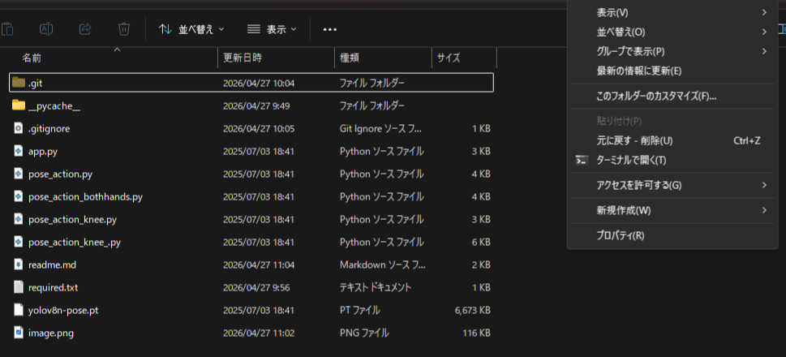
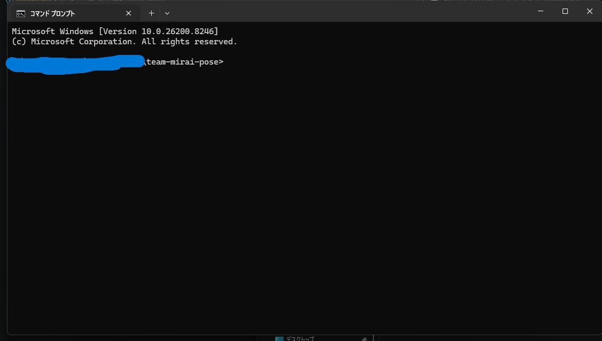
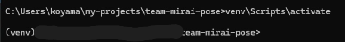

# 姿勢推定システム（Pose Estimation）の準備と動かし方

※このシステムはwindows11実行想定です。
## 前提
* VScodeがインストールされてること
* pythonがインストールされていること

[Pythonのダウンロード方法 for windows](https://www.python.jp/install/windows/install.html)

[Pythonのダウンロード方法 for mac](https://blog.pyq.jp/entry/python_install_241030_mac)

## 前準備
### 環境にDLする。
1.右上の、`code`を押します。

2.`DownloadZIP`を押して、任意のフォルダーに保存します。(本当は、ディレクトリ直下が好ましい)


3.エクスプローラから、ダウンロードしたファイルにアクセスします。

4.フォルダーを開いたら、左クリックを押します。

5.左クリックを押すと、項目が出てきてその中の「ターミナルで開く」をクリック


6.ユーザーネームのあとに`\learn-pose-main`と表示されていたら準備完了です



## 1. 仮想環境（専用の作業部屋）を作る
[仮想環境とは](https://qiita.com/yasu_qita/items/197c94b2ad3003233407)

まずは、他のプログラムと設定が混ざらないように、システム専用の「部屋」を作る。
ターミナルを開いて、以下のコマンドを実行。

```bash
python3 -m venv venv
```

## 2.仮想環境に入りましょう。

仮想環境に入るためのコマンドは以下のとおりです。

```cmd
# コマンドプロンプトの場合
venv\Scripts\activate
```

``` powershell
# powershell の場合
venv\Scripts\activate.ps1
```

```bash
# linux or mac
source venv/bin/activate
```

仮想環境に入るとこのような表示になると思います。



ターミナルの一番左に(venv)と書かれていば仮想環境に入れている状態です。

## 3.必要なライブラリをインストールする

すでに、必要なライブラリをメモしてある`required.txt`というのを実行します。

```bash
pip install -r required.txt
```

これで最低限の準備は完了しました。

## 4.実行!!
```cmd
# コマンドプロンプト
python app.py
```
```bash
# linux
python app.py
```
``` bash
# macの場合
python3 app.py
```
